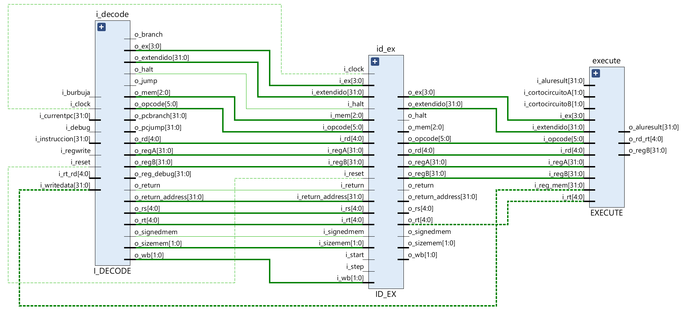
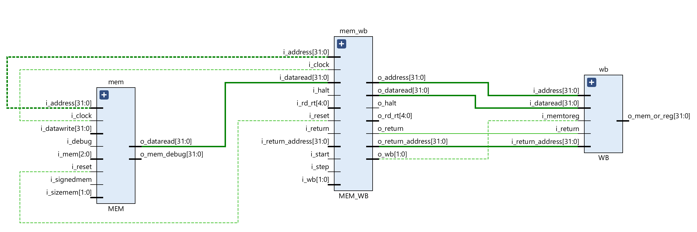

### Arquitectura de Computadoras - UNC - FCEFyN
## Francisco Daniele - Julian Gonzalez
# TP3: MIPS

### Desarrollo
---
1. ### Pipeline
#### Etapa I_FETCH
Este modulo, llamado _I_FETCH.v_ consiste en una memoria de instrucciones (_MEM_INSTRUCCIONES.v_), el program counter (_PC.v_), un sumador (_PC_ADDER.v_), un multiplexor para elegir el proximo pc (_PC_MUX.v_) y otro (_MUX_INSTR_NOP.v_) para seleccionar la instruccion obtenida de la memoria, intercalar una NOP en caso de un branch o una HALT en caso de esa instruccion.

Sus inputs:
-   i_address: es la direccion que ingresa a la memoria, en caso de estar cargandola viene desde la debug unit y se guarda la instruccion en dicha posicion, y en caso de estar funcionando el pipeline se direcciona mediante el pc y se obtiene la instruccion en esa posicion.
-   i_instruccion: es la instruccion a guardar en la memoria en caso de estar cargandola.
-   i_loading: si está en uno significa que estamos cargando instrucciones y si está en cero se van a obtener instrucciones guardadas.
-   i_pcburbuja: viene desde el detector de riesgos, si está en uno se mantiene el pc anterior para hacer un stall.
-   i_start: indica que el procesador esta en funcionamiento si esta en alto.
-   i_step: si esta en alto quiere decir que se esta ejecutando un step mediante debug.
-   i_pc_branch: viene desde la unidad de branch e ingresa a pc_mux. Es el pc calculado de una instruccion branch.
-   i_pc_jump: viene desde la unidad de jump e ingresa a pc_mux. Es el pc calculado de una instruccion jump.
-   i_select: selecciona entre i_pc_jump, i_pc_branch e i_pc_incr (PC + 1) para la entrada del Program Counter.

Está conectada al latch _IF_ID_ mediante sus outputs:
-   o_instruccion: es la instruccion obtenida de la memoria, que seguira su camino en el pipeline.
-   o_pc_incr: es PC + 1 de la instruccion obtenida.

Además, tiene la salida _o_pc_debug_ que está conectada a la debug unit.

---
#### Etapa I_DECODE
Consiste en un banco de registros (_REG_BANK.v_), la unidad de branch (_U_BRANCH.v_), la de jump (_U_JUMP.v_), un extensor de signo (_EXTENSOR.v_), la unidad de control principal (_CONTROL_PRINCIPAL.v_), un sumador que obtiene el pc de una instruccion branch, un mux (_MUX_CONTROL_PRINCIPAL.v_) que elige entre los bits de control de c/ instruccion o bits "nulos" si se trata de un stall y otro (_MUX_RD_31.v_) que elige entre el registro _rd_, normalmente, o en caso de se una instruccion JAL elige el _reg 31_.

Inputs:
-   i_debug: ingresa al reg bank, es un pulso que va aumentando un contador para ir pasando uno a uno el contendido de los registros hacia la unidad de debug.
-   i_rt_rd: viene de WB, es el registro que se debe escribir en caso de ser necesario.
-   i_regwrite: si es uno, se escribe un registro.
-   i_writedata: el dato a escribir.
-   i_instruccion: es la instruccion actual.
-   i_burbuja: entra al mux que en caso de ser un uno, intercala bits de control nulos por ser un stall.
-   i_currentpc: ingresa al sumador para obtener el pc nuevo en caso de un branch. Tambien a la unidad de jump para calcular el pc en dichas instrucciones.

Esta etapa esta conectada con sus salidas a _ID_EX_:
-   o_regA: es el contenido del registro indicado por la entrada _rs_.
-   o_regB: es el contenido del registro indicado por la entrada _rt_.
-   o_mem: son 3 bits de control para la etapa _MEM_ obtenidas segun c/ instruccion en la unidad de control principal.
-   o_ex: son 4 bits de control para la etapa _EXECUTE_ obtenidas segun c/ instruccion en la unidad de control principal.
-   o_wb: son 2 bits de control para la etapa _WB_ obtenidas segun c/ instruccion en la unidad de control principal.
-   o_signedmem: es un bit de control para las instrucciones de tipo _load_.
-   o_sizemem: 2 bits de control para instrucciones _load_ y _store_.
-   o_halt: esta en alto si la instruccion actual es HALT, este bit se va pasando por todas las etapas para en el final parar el procesador, dejando terminar las instrucciones anteriores.
-   o_branch: en caso de una instruccion branch, se pone en uno.
-   o_pcbranch: el proximo pc en caso de branch.
-   o_jump: en caso de una instruccion jump, se pone en uno.
-   o_pcjump: el proximo pc en caso de jump.
-   o_return: se pone en alto con las instrucciones JAL y JALR para guardar la direccion de retorno.
-   o_return_address: la direccion de retorno en caso de JAL y JALR. Con la primera se escribe en el reg 31 y con la segunda en el indicado en la instruccion.
-   o_opcode: son los 6 bits mas altos de la instruccion.
-   o_rs: los bits 25:21 de la instruccion.
-   o_rt: los bits 20:16 de la instruccion.
-   o_rd: los bits 15:11 de la instruccion.
-   o_extendido: bits 15:0 de la instruccion.

Está conectada a la debug unit con _o_reg_debug_ para ir pasando el contenido de los registros a la misma.

---
#### Etapa EXECUTE
Esta etapa consta de una ALU (_ALU.v_), donde se realizan todos los calculos, un modulo de control de la ALU (_ALU_CONTROL.v_), 1 mux (_MUX_EX_REGA_RESULT_MEM.v_) que define el dato a y 2 (_MUX_EX_REGA_RESULT_MEM.v_ y _MUX_2_1_EX.v_) que definen el dato b que ingresan a la ALU. Además hay otro mux (_MUX_RT_RD.v_) que define si el registro a escribir en la instruccion correspondiente es _rt_ o _rd_ segun _regdst_. 

Inputs:
-   i_cortocircuito A y B: son 2 bits que vienen de la unidad de cortocircuito que determinan de donde se obtienen los datos A y B de la ALU.
-   i_reg A y B: son los valores que vienen del banco de registros (_rs_ y _rt_).
-   i_aluresult: es el valor de la ultima operacion realizada por la ALU, para utilizar si hay que hacer cortocircuito.
-   i_reg_mem: es el valor leido en memoria, para utilizar si hay que hacer cortocircuito de un load.
-   i_ex: son los bits de control de esta etapa. Alusrc es el bit mas alto y determina que valor se seleccionara para el dato B de la ALU. Aluop son los 2 bits mas bajos y se usan para el control de la ALU.
-   i_extendido: son los 16 bits mas bajos de la instruccion, pueden ser usados como dato B.
-   i_rd, i_rt: son los registros de la instruccion y entran a _MUX_RT_RD.v_ para determinar cual será escrito.
-   i_opcode: se utiliza para control de la ALU.

Mediante sus outputs está conectado al latch _EX_MEM_:
-   o_regB: en el caso de un _store_ es el valor que se escribira en memoria.
-   o_aluresult: es el resultado de la ultima operacion.
-   o_rd_rt: es el registro que será escrito en la etapa WB.

---
#### Etapa MEM
Consiste en una memoria de datos (_MEM_DATOS.v_).
Inputs:
-   i_address: direccion de la memoria donde se escribira o leera la memoria.
-   i_datawrite: dato a escribir en la memoria.
-   i_debug: ingresa a la memoria, es un pulso que va aumentando un contador para ir pasando uno a uno el contendido de la memoria hacia la unidad de debug.
-   i_mem: son 2 bits de control de la etapa. Memread si es uno es un _load_ y memwrite es uno si es un _store_.
-   i_signedmem: indica si la instruccion de _load_ es signada o no.
-   i_sizemem: indica el tamaño de la operacion de memoria (byte, half word o word).

Con sus outputs esta conectada al latch _MEM_WB_:
-   o_dataread: es el dato leido.

Con la salida o_mem_debug está conectada a la unidad de debug por la cual le enviara los datos leidos de la memoria.

---
#### Etapa WB
Consiste en 2 mux (_MUX_DATAREG.v_ y _MUX_WB.v_). El primero en el caso de ser un JAL o JALR elige como salida i_return_address y en las demas i_address (el resultado de la ALU). El segundo MUX elige entre el dato leido en la memoria, en _loads_, y si es otra operacion elige la salida del mux anterior.

Inputs:
-   i_dataread: dato leido en MEM.
-   i_address: resultado de la ALU.
-   i_return: si es 1 se trata de un JAL o JALR.
-   i_return_address: dato a escribir en un registro en caso de JAL o JALR.
-   i_memtoreg: bit de control de la etapa, este indica si se debe escribir un registro.

Su salida o_mem_or_reg es el dato a escribir en el reg bank o el dato leido en memoria que sirve para la unidad de cortocircuito.

---
#### Latches
Estos son quienes reciben y pasan informacion de una etapa a otra, los bits de control, etc. Estan manejados por el clock y tienen las entradas _i_start_ que se pone en 1 cuando la unidad de debug lanza el procesador, e _i_step_ que en caso de modo continuo es siempre 1 y en modo debug se activa con un comando por UART. Estas entradas permiten el avance de los datos, y por consiguiente del procesador, o no.
-   IF_ID:

-   ID_EX:

-   EX_MEM:

-   MEM_WB:

---
#### Unidad de cortocircuito
Esta unidad recibe los registros _rs_ y _rt_ de la instruccion actual y los compara con los registros _rt_ o _rd_ que contienen los resultados de la ALU o de memoria de las 2 instrucciones anteriores y decide si debe hacer cortocircuito o no.

---
#### Detector de riesgos
Esta unidad detecta si hay riesgo de load, que es cuando hay que hacer cortocircuito pero al ser un load hay que esperar un ciclo para tener el dato. En caso de ser necesario, se hace un stall que para el PC, intercala bits de control nulos entre la operacion actual y la siguiente.

---
2. ### Debug Unit
asdasdasd

---
3. ### Analisis de tiempo
Para el sistema utilizamos un clock del clock wizard de IP-Core, que tiene una frecuencia de input de 100 MHz y alimenta al sistema con una frecuencia de salida de 69 MHz (periodo 14.49275 ns). Escogimos esta frecuencia de clock ya que según lo investigado (_https://support.xilinx.com/s/article/57304?language=en_US_) la forma de encontrar la maxima frecuencia posible es buscando un clock objetivo que en el reporte de timing de un WNS (_worst negative slack_) menor a 0. Una vez obtenido, en nuestro caso fue de 70 MHz, se realiza el siguiente calculo: $\frac{1}{T-WNS}$ con T = 14.286ns y WNS = -0.086ns. Esto nos da como resultado una frecuencia maxima de 69.579738 MHz. Luego, fuimos afinando hasta obtener el clock que nos de WNS, WHS y WPWS mayores a 0 y TNS, THS y TPWS iguales a 0 que según el manual _UltraFast Design Methodology Guide for Xilinx FPGAs and SoCs_ deben tener dichos valores. Este clock obtenido fue el de 69 MHz.

---
4. ### Testbenches
asdasdsd

---
5. ### MIPS assembler a codigo maquina
sadasdasd

---
6. ### Conclusiones
sadasds

