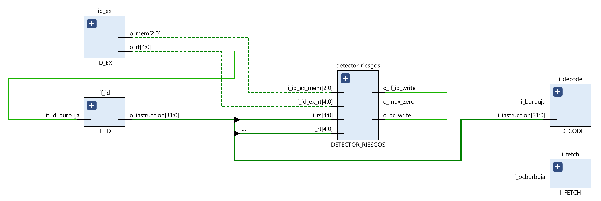

### Arquitectura de Computadoras - UNC - FCEFyN
## Francisco Daniele - Julian Gonzalez
# TP3: MIPS

### Desarrollo
---
1. ### Pipeline
#### Etapa I_FETCH
Este modulo, llamado _I_FETCH.v_ consiste en una memoria de instrucciones (_MEM_INSTRUCCIONES.v_), el program counter (_PC.v_), un sumador (_PC_ADDER.v_), un multiplexor para elegir el proximo pc (_PC_MUX.v_) y otro (_MUX_INSTR_NOP.v_) para seleccionar la instruccion obtenida de la memoria, intercalar una NOP en caso de un branch o una HALT en caso de esa instruccion.

Sus inputs:
-   i_address: es la direccion que ingresa a la memoria, en caso de estar cargandola viene desde la debug unit y se guarda la instruccion en dicha posicion, y en caso de estar funcionando el pipeline se direcciona mediante el pc y se obtiene la instruccion en esa posicion.
-   i_instruccion: es la instruccion a guardar en la memoria en caso de estar cargandola.
-   i_loading: si está en uno significa que estamos cargando instrucciones y si está en cero se van a obtener instrucciones guardadas.
-   i_pcburbuja: viene desde el detector de riesgos, si está en uno se mantiene el pc anterior para hacer un stall.
-   i_start: indica que el procesador esta en funcionamiento si esta en alto.
-   i_step: si esta en alto quiere decir que se esta ejecutando un step mediante debug.
-   i_pc_branch: viene desde la unidad de branch e ingresa a pc_mux. Es el pc calculado de una instruccion branch.
-   i_pc_jump: viene desde la unidad de jump e ingresa a pc_mux. Es el pc calculado de una instruccion jump.
-   i_select: selecciona entre i_pc_jump, i_pc_branch e i_pc_incr (PC + 1) para la entrada del Program Counter.

Está conectada al latch _IF_ID_ mediante sus outputs:
-   o_instruccion: es la instruccion obtenida de la memoria, que seguira su camino en el pipeline.
-   o_pc_incr: es PC + 1 de la instruccion obtenida.

Además, tiene la salida _o_pc_debug_ que está conectada a la debug unit.

---
#### Etapa I_DECODE
Consiste en un banco de registros (_REG_BANK.v_), la unidad de branch (_U_BRANCH.v_), la de jump (_U_JUMP.v_), un extensor de signo (_EXTENSOR.v_), la unidad de control principal (_CONTROL_PRINCIPAL.v_), un sumador que obtiene el pc de una instruccion branch, un mux (_MUX_CONTROL_PRINCIPAL.v_) que elige entre los bits de control de c/ instruccion o bits "nulos" si se trata de un stall y otro (_MUX_RD_31.v_) que elige entre el registro _rd_, normalmente, o en caso de se una instruccion JAL elige el _reg 31_.

Inputs:
-   i_debug: ingresa al reg bank, es un pulso que va aumentando un contador para ir pasando uno a uno el contendido de los registros hacia la unidad de debug.
-   i_rt_rd: viene de WB, es el registro que se debe escribir en caso de ser necesario.
-   i_regwrite: si es uno, se escribe un registro.
-   i_writedata: el dato a escribir.
-   i_instruccion: es la instruccion actual.
-   i_burbuja: entra al mux que en caso de ser un uno, intercala bits de control nulos por ser un stall.
-   i_currentpc: ingresa al sumador para obtener el pc nuevo en caso de un branch. Tambien a la unidad de jump para calcular el pc en dichas instrucciones.

Esta etapa esta conectada con sus salidas a _ID_EX_:
-   o_regA: es el contenido del registro indicado por la entrada _rs_.
-   o_regB: es el contenido del registro indicado por la entrada _rt_.
-   o_mem: son 3 bits de control para la etapa _MEM_ obtenidas segun c/ instruccion en la unidad de control principal.
-   o_ex: son 4 bits de control para la etapa _EXECUTE_ obtenidas segun c/ instruccion en la unidad de control principal.
-   o_wb: son 2 bits de control para la etapa _WB_ obtenidas segun c/ instruccion en la unidad de control principal.
-   o_signedmem: es un bit de control para las instrucciones de tipo _load_.
-   o_sizemem: 2 bits de control para instrucciones _load_ y _store_.
-   o_halt: esta en alto si la instruccion actual es HALT, este bit se va pasando por todas las etapas para en el final parar el procesador, dejando terminar las instrucciones anteriores.
-   o_branch: en caso de una instruccion branch, se pone en uno.
-   o_pcbranch: el proximo pc en caso de branch.
-   o_jump: en caso de una instruccion jump, se pone en uno.
-   o_pcjump: el proximo pc en caso de jump.
-   o_return: se pone en alto con las instrucciones JAL y JALR para guardar la direccion de retorno.
-   o_return_address: la direccion de retorno en caso de JAL y JALR. Con la primera se escribe en el reg 31 y con la segunda en el indicado en la instruccion.
-   o_opcode: son los 6 bits mas altos de la instruccion.
-   o_rs: los bits 25:21 de la instruccion.
-   o_rt: los bits 20:16 de la instruccion.
-   o_rd: los bits 15:11 de la instruccion.
-   o_extendido: bits 15:0 de la instruccion.

Está conectada a la debug unit con _o_reg_debug_ para ir pasando el contenido de los registros a la misma.

---
#### Etapa EXECUTE
dasdas

---
#### Etapa MEM
sads

---
#### Etapa WB
asdasd

---
#### Latches
-   IF_ID:

-   ID_EX:

-   EX_MEM:

-   MEM_WB:

---
#### Unidad de cortocircuito
asdasd

---
#### Detector de riesgos
asdadsa

---
2. ### Debug Unit
asdasdasd

---
3. ### Analisis de tiempo
adasda

---
4. ### Testbenches
asdasdsd

---
1. ### MIPS assembler a codigo maquina
sadasdasd